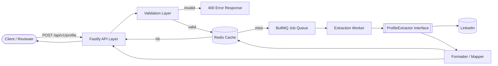

# Tross LinkedIn Profile API

A hosted HTTP API that accepts a LinkedIn profile URL and returns structured JSON (name, headline, location, about, experience, education, skills, certifications, languages, images). Built for the Tross engineering hiring challenge.

> **Extraction is real, not mocked.** An authenticated LinkedIn extractor with a no-login public fallback, both behind a swappable `ProfileExtractor` interface — see [Extraction layer](#extraction-layer).

## Contents

- [Quick start](#quick-start)
- [API](#api)
- [Approach](#approach)
- [Extraction layer](#extraction-layer)
- [Project structure](#project-structure)
- [Configuration](#configuration)
- [Testing](#testing)
- [Deployment](#deployment)
- [Known limitations](#known-limitations)

## Quick start

### Option A — Docker Compose (app + Redis together)

```bash
docker-compose -f docker/compose/docker-compose.yml up --build
curl http://localhost:3000/health
```

<details>
<summary><strong>Stuck on <code>localhost:3000</code> after <code>docker compose up</code>, even though <code>docker ps</code> shows everything healthy? (macOS)</strong></summary>

**Symptom:** `docker compose ps` shows both containers `Up`/`healthy`, `docker compose logs app` shows `Server listening at http://127.0.0.1:3000`, but the browser hangs indefinitely on `localhost:3000` and `curl http://127.0.0.1:3000/health` fails outright with:

```
curl: (7) Failed to connect to 127.0.0.1 port 3000 after 0 ms: Couldn't connect to server
```

**This is not a bug in this project.** It's a macOS networking issue, seen in the wild while testing this exact setup: a VPN or corporate security client (Zscaler, Cisco AnyConnect, and similar tools are known to do this) has hijacked the `lo0` loopback interface and removed the standard `127.0.0.1` address, replacing it with something like `10.10.10.1`. Every app on the machine — not just this one — becomes unreachable at `localhost`/`127.0.0.1` until it's fixed, because the failure happens at the OS socket layer, before the connection ever reaches Docker's port mapping.

**Diagnose it:**

1. Confirm the app really is listening and Redis is reachable (rules out an app-level hang):
   ```bash
   docker compose -f docker/compose/docker-compose.yml logs app   # look for "Server listening at http://127.0.0.1:3000"
   docker compose -f docker/compose/docker-compose.yml exec redis redis-cli ping   # expect PONG
   ```
2. Confirm Docker's port mapping is correct (rules out a Docker-config issue):
   ```bash
   docker ps   # look for 0.0.0.0:3000->3000/tcp in the app container's PORTS column
   ```
3. Check whether `127.0.0.1` actually exists on the loopback interface — this is the tell:
   ```bash
   ifconfig lo0 | grep "inet "
   ```
   If you see something like `inet 10.10.10.1 netmask 0xffffffff` and **no** `127.0.0.1` line at all, that confirms it.

**Fix it:**

```bash
sudo ifconfig lo0 alias 127.0.0.1 up
```

This adds `127.0.0.1` back as an additional address on `lo0` alongside whatever the VPN added — it doesn't remove or fight the VPN's own address, so it's safe to run. Verify with `ifconfig lo0 | grep "inet "` (you should now see both addresses) and `curl http://127.0.0.1:3000/health`.

**Not permanent** — a VPN reconnect or a reboot can re-apply the hijack, so you may need to re-run the command after either. If this happens repeatedly on a work machine, it's worth flagging to IT — the VPN client's behavior is the root cause, not something any app can fix on its own.

</details>

### Option B — local Node

Requires Node 20+ and a Redis instance reachable at `REDIS_URL` (defaults to `redis://localhost:6379`).

```bash
npm install
cp .env.example .env
npm run dev        # tsx watch, http://localhost:3000
```

Try it:

```bash
curl -X POST http://localhost:3000/api/v1/profile \
  -H 'Content-Type: application/json' \
  -d '{"linkedin_url":"https://www.linkedin.com/in/jane-doe-example"}'
```

The first call fetches through the extraction pipeline (`meta.source: "live"`); repeat the same URL and it's served from Redis (`meta.source: "cache"`).

There's also a minimal browser UI at [`http://localhost:3000`](http://localhost:3000) — a single form that POSTs to `/api/v1/profile` and prints the raw JSON response (`public/index.html`, served by `src/api/routes/ui.routes.ts`, no framework or build step).

## API

Full contract: [`docs/07_API_Contract.md`](docs/07_API_Contract.md).

### `POST /api/v1/profile`

```json
{ "linkedin_url": "https://www.linkedin.com/in/example-profile" }
```

**200 OK**

```json
{
  "status": "success",
  "data": {
    "name": "Jane Doe",
    "headline": "Senior Software Engineer at Example Co.",
    "location": "Bengaluru, India",
    "about": "...",
    "experience": [ { "title": "...", "company": "...", "duration": "...", "location": "...", "description": "..." } ],
    "education": [ { "school": "...", "degree": "...", "duration": "..." } ],
    "skills": ["TypeScript", "Node.js"],
    "certifications": [ { "name": "...", "issuer": "...", "date": "..." } ],
    "languages": ["English", "Hindi"],
    "images": { "profile_photo": "https://...", "banner": null }
  },
  "meta": { "source": "cache", "fetched_at": "2026-08-28T10:15:00Z" }
}
```

**Missing-field convention** (applied consistently by `src/formatter/profileFormatter.ts`): a field that exists on the profile but is empty is `null` (scalars/objects) or `[]` (arrays). A section LinkedIn doesn't expose for this profile at all is **omitted** from the object entirely.

### `GET /health`

```json
{ "status": "ok" }
```

### Errors

Every error, from every endpoint, uses one shape:

```json
{ "status": "error", "error": { "code": "PROFILE_PRIVATE_OR_UNREACHABLE", "message": "...", "http_status": 422 } }
```

| Code | HTTP | Meaning |
|---|---|---|
| `INVALID_URL` | 400 | Not a valid `linkedin.com/in/<slug>` URL |
| `PROFILE_NOT_FOUND` | 404 | Profile doesn't exist |
| `PROFILE_PRIVATE_OR_UNREACHABLE` | 422 | Profile exists but data isn't accessible |
| `UPSTREAM_RATE_LIMITED` | 429 | Extraction layer (or the API's own client rate limiter) is throttled |
| `EXTRACTION_TIMEOUT` | 504 | Extraction took too long |
| `INTERNAL_ERROR` | 500 | Unexpected failure (no stack trace returned to the client) |

## Approach

Full design docs are in [`docs/`](docs/) (`01_HLD.md` through `08_Risk_Limitations.md`) — they were written first and the implementation follows them.

- **No browser automation in the live path**, per the challenge's official clarification ([`docs/00_Original_Challenge.md`](docs/00_Original_Challenge.md)): both deployed extractors only make direct HTTP calls to LinkedIn's own endpoints.
- **Layered single service**, not microservices: API (Fastify) → validation → cache (Redis) → queue (BullMQ) → extraction (behind an interface) → formatter → response, each a separate module.
- **Sync-with-timeout request mode**: the client gets one HTTP response, backed internally by a real BullMQ job (bounded by `EXTRACTION_TIMEOUT_MS`) so retry/backoff and the extraction throttle are real, not simulated.
- **Isolation of the extraction layer**: `ProfileExtractor.fetch(url)` is the one seam the rest of the system depends on — swap in a different implementation and nothing else changes.
- **Fail-open cache**: if Redis is down, cache reads/writes log a warning and behave as a miss/no-op rather than failing the request.

Deviations from the design docs (naming choices and internal plumbing, no contract impact) are logged in [`docs/03_Architecture.md` §7](docs/03_Architecture.md#7-deviations-from-the-design-docs).



Sequence, deployment, and error-flow diagrams: [`docs/04_Architecture_Diagram.md`](docs/04_Architecture_Diagram.md).

## Extraction layer

Four implementations behind the same `ProfileExtractor` interface. `src/queue/worker.ts` chooses between the two *deployed* ones per request, with automatic fallback — there is no mock/fake data anywhere in the live request path.

| Extractor | Used when | What it does |
|---|---|---|
| `linkedinExtractor.ts` | Tried first, whenever credentials are configured | Authenticated calls straight to LinkedIn's internal APIs — full data, confirmed live-working end to end (2026-08-31). |
| `publicExtractor.ts` | No credentials set, **or** as automatic fallback if `linkedinExtractor` fails | Reads the schema.org `JSON-LD` block on the public profile page — real but partial data, no login. |
| `playwrightExtractor.ts` | Local-only, manual (`npm run extract:local -- <url>`) | Headless-browser diagnostic tool. **Never** deployed or on the request path (not permitted by the challenge brief; also too heavy for Render's free tier). |
| `mockExtractor.ts` | Test suite only | Fixture data so tests don't need network access or real credentials. |

Both LinkedIn systems it calls (the Voyager "Dash" top-card API and the React "Flight protocol" section renderer) are unofficial and reverse-engineered, self-paced by `linkedinPacing.ts` to avoid tripping LinkedIn's account-level rate limits. Full breakdown — per-extractor internals, the auth cookie setup steps, and how credential lifetime is meant to be evaluated: [`docs/09_Extraction_Layer.md`](docs/09_Extraction_Layer.md).

## Project structure

```
public/
 └── index.html       minimal demo form (no framework/build step), served at GET /
src/
 ├── api/            routes, controllers, Fastify bootstrap
 ├── validation/      LinkedIn URL shape check + normalization
 ├── cache/           Redis client + get/set with TTL, fail-open
 ├── queue/           BullMQ producer (queue.ts) + consumer (worker.ts)
 ├── extraction/       ProfileExtractor interface + implementations (linkedin/public/playwright/mock)
 ├── formatter/        raw -> public schema mapping
 ├── services/        orchestrates cache -> queue -> formatter
 ├── errors/          error classes + centralized Fastify error handler
 ├── config/          single env loader
 └── types/           shared request/response/domain types
scripts/
 ├── tryPlaywrightExtractor.ts       local-only manual runner for playwrightExtractor.ts (npm run extract:local)
 └── probeLinkedinDashSections.ts    local-only raw dump of the top-card + Flight-protocol section responses (npm run probe:linkedin)
tests/
 ├── unit/            validation, formatter, error handler, cache, queue error-mapping, extractors
 └── integration/     full POST /api/v1/profile route, via the stub extractor
docs/                 design docs (this repo's source of truth) + DEPLOY.md
docker/compose/       docker-compose.yml (build context points back at the repo root)
```

## Configuration

All config is loaded once via `src/config/index.ts`, from environment variables — see [`.env.example`](.env.example) for the full list and defaults (port/host, Redis URL, cache TTL, extraction timeout/attempts/throttle, client rate limit). No secrets are committed; `.env` is gitignored.

## Testing

```bash
npm test
```

83 tests across 12 files: URL validation (valid/invalid/normalization), the Flight-protocol wire-format parser and section parsers, both extractors, formatter (null vs. omission convention), centralized error handler (each `AppError` → correct status/shape), and a full integration test that exercises `POST /api/v1/profile` end-to-end through the real stub extractor, Redis cache, and BullMQ queue/worker (requires a reachable Redis, same as running the app).

## Deployment

Target: [Render](https://render.com), via the repo's `Dockerfile`. Full steps, including every environment variable to set: [`docs/DEPLOY.md`](docs/DEPLOY.md).

```bash
npm run build   # tsc -> dist/
npm start        # node dist/api/server.js
```

## Known limitations

Full write-up, including the incident history behind the fixes below: [`docs/08_Risk_Limitations.md`](docs/08_Risk_Limitations.md). Current-state highlights:

- **LinkedIn's extraction surface is genuinely volatile.** Three rounds of real breakage since first deploying — a stale-cookie block, a retired GraphQL query, and two parsing bugs of its own — all resolved and verified live as of 2026-08-31. Full account of each: [`docs/08_Risk_Limitations.md` §7](docs/08_Risk_Limitations.md#7-incident-history).
- Neither shipped extractor does bot-detection evasion — no proxy rotation, no fingerprint spoofing, no CAPTCHA solving.
- **Experience/education/skills/certifications/languages/about are confirmed live-verified** via LinkedIn's Flight-protocol component actions. No language-proficiency field is surfaced (languages return name only). Education's `degree` is LinkedIn's raw combined "Degree, Field of study" string, unsplit.
- **On a double failure** (authenticated extractor fails, then the anonymous fallback also fails), the client sees the authenticated path's error — the more accurate signal, e.g. an actual LinkedIn block — rather than the fallback's generic "unreachable". `worker.ts` used to silently swallow the authenticated failure reason in this case, masking that both paths had hit the same underlying block; fixed.
- **Render's free tier spins the instance down after inactivity** — the first request after a period of no traffic pays a cold-start delay (tens of seconds) before `/health` or `/api/v1/profile` responds; subsequent requests are fast. Not something this codebase can fix without a paid plan.
- **Single-region, single-instance deployment** — no horizontal scaling implemented (the architecture supports adding it later; see `docs/03_Architecture.md` §4).
- **No persistent database** — Redis is a cache with a TTL, not durable storage; a flush means re-fetching on next request.
- **No authentication/authorization** on the API itself — out of scope per the challenge, would be a next step for production.
- **Async job-status polling** (`GET /api/v1/profile/status/:jobId`) is designed for but not implemented — the current sync-with-timeout mode covers the challenge's requirements; the queue is structured so polling is a small addition later.
