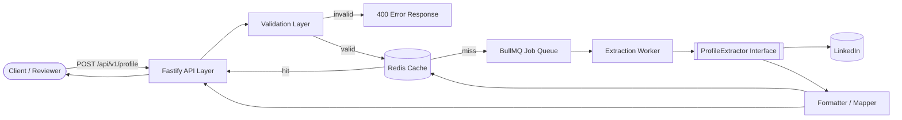
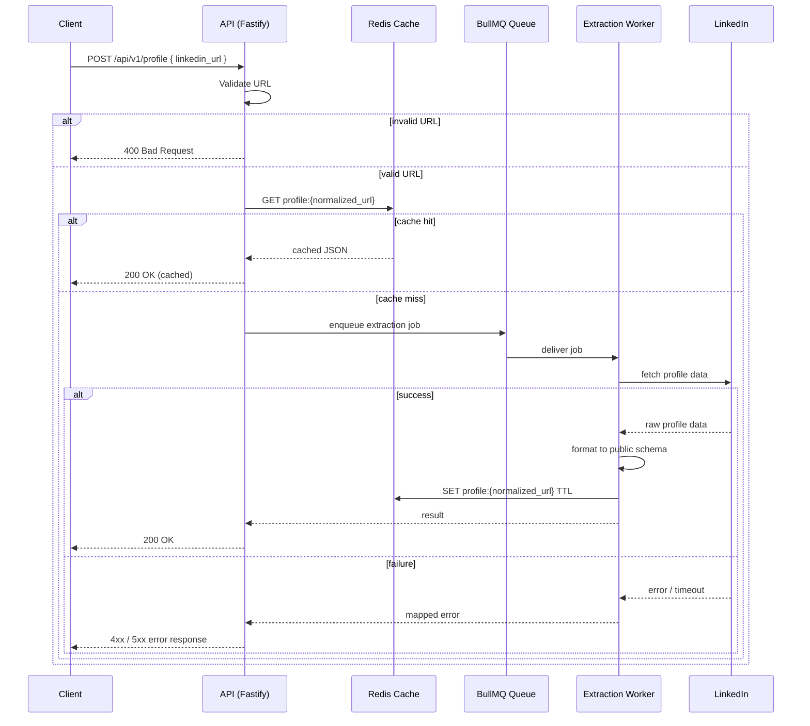
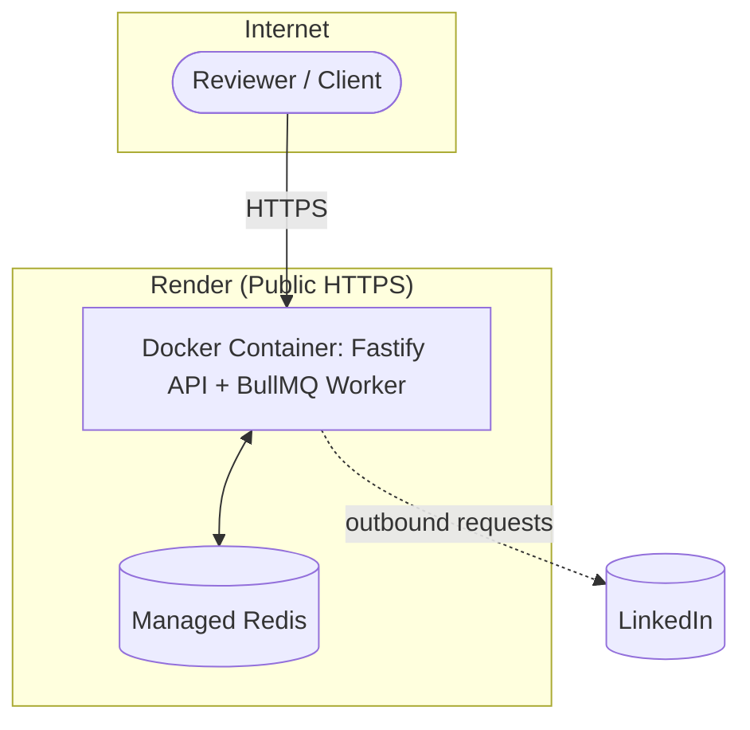
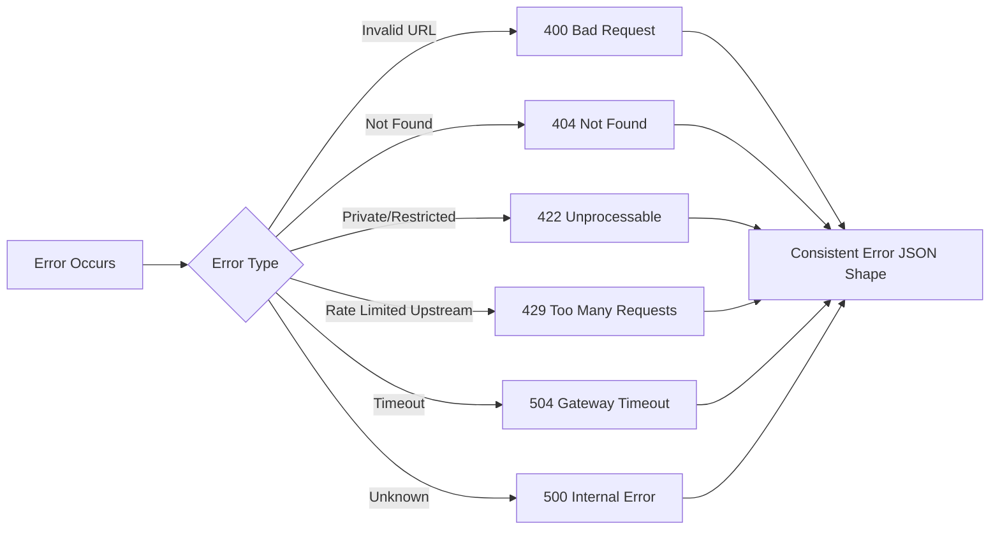

# Architecture Diagrams
## LinkedIn Profile API — Tross Hiring Challenge

These are written in [Mermaid](https://mermaid.js.org/) syntax, which renders natively on GitHub — paste this file directly into the repo and the diagrams will render in the README/docs without any image export needed.

---

## 1. System Component Diagram

## 2. Request Sequence Diagram (Sync-with-timeout mode)

## 3. Deployment Diagram

## 4. Error Handling Flow

